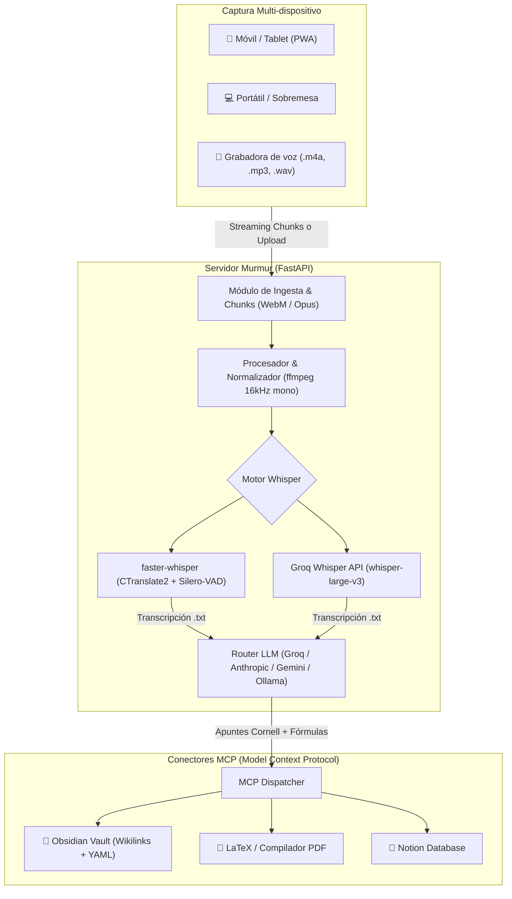

# 🎙️ Murmur

> **Sistema inteligente open-source para captura de clases, transcripción con Whisper, generación de apuntes académicos con LLMs y sincronización mediante Model Context Protocol (MCP) a Notion, Obsidian y LaTeX.**

[](LICENSE)
[](https://www.python.org/downloads/)
[](https://fastapi.tiangolo.com)
[](https://github.com/openai/whisper)
[](https://modelcontextprotocol.io)

---

## 🌟 ¿Qué es Murmur?

Murmur nace de una necesidad real compartida por estudiantes, investigadores y opositores: **asistir a clase sin tener que elegir entre escuchar al profesor o dejarse la muñeca escribiendo apuntes a medias**.

Con Murmur puedes:
1. **Grabar desde cualquier dispositivo:** Abre la aplicación web (PWA) en tu **móvil, tablet o portátil** mientras estás en el aula.
2. **Protección anti-fallos:** El audio se transmite y sincroniza en trozos (*chunks*) seguros cada minuto; si el móvil se queda sin batería en mitad de una clase de 2 horas, no se pierde lo anterior.
3. **Transcripción Whisper ultrarrápida:** Utiliza Whisper en la nube (Groq Cloud en segundos) o en local (`faster-whisper` con Silero-VAD).
4. **Apuntes con Método Cornell:** Cualquier LLM (Llama 3.3, Claude 3.5, Gemini 2.0 Flash o GPT-4o) sintetiza la transcripción eliminando muletillas, extrayendo definiciones, formulando ecuaciones matemáticas en LaTeX y destacando preguntas de examen.
5. **Conexión MCP Multicanal:** Exporta con un clic a tu bóveda de **Obsidian** (con wikilinks y frontmatter), genera un documento **LaTeX / PDF** maquetado o publica en **Notion**.

---

## 🏗️ Arquitectura del Sistema



---

## 🚀 Instalación en un Solo Comando

### Opción 1: Instalación Rápida con un solo comando (Recomendado)

En tu terminal Linux o macOS:

```bash
curl -fsSL https://raw.githubusercontent.com/Ismael-Sallami/murmur/main/install.sh | bash
```

O clonando el repositorio manualmente:

```bash
git clone https://github.com/Ismael-Sallami/murmur.git
cd murmur
./install.sh
```

El instalador comprobará `python3`, `ffmpeg` y configurará un entorno aislado con `uv` en menos de 15 segundos.

### Opción 2: Con Docker Compose

Si prefieres aislar todo en contenedores:

```bash
docker compose up -d
```

Abre tu navegador en `http://localhost:8000` (o desde tu móvil conectado a la misma red Wi-Fi: `http://IP_DE_TU_PC:8000`).

---

## ⚙️ Configuración (.env)

Copia el fichero `.env.example` a `.env` y configura los proveedores que prefieras:

```bash
cp .env.example .env
```

Parámetros principales:

```env
# Transcripción Whisper
WHISPER_PROVIDER=groq          # 'groq', 'openai' o 'faster-whisper'
GROQ_API_KEY=gsk_...           # Obtén tu clave gratis en https://console.groq.com

# Generación de Apuntes (LLM)
LLM_PROVIDER=groq              # 'groq', 'anthropic', 'gemini', 'openai', 'ollama'
LLM_MODEL=llama-3.3-70b-versatile

# Destinos de Exportación
OBSIDIAN_VAULT_PATH=/home/usuario/Documentos/MiBovedaObsidian
NOTION_API_KEY=secret_...
NOTION_DATABASE_ID=...
```

---

## 📱 Uso en el Aula y Conexión Móvil

1. **Inicia Murmur con soporte SSL en tu PC:**
   ```bash
   murmur --ssl
   ```
   > **Nota de seguridad:** Los navegadores móviles (Chrome en Android y Safari en iOS) requieren una conexión segura (HTTPS) para habilitar el acceso al micrófono en redes locales. Murmur genera automáticamente un certificado local autofirmado para tu red.

2. **Abre Murmur en tu móvil o tablet:**
   - Conéctate a la misma red Wi-Fi que tu PC (o mediante VPN como Tailscale).
   - Abre el navegador y accede a `https://<IP_DE_TU_PC>:8000` (ejemplo: `https://172.17.64.141:8000`).
   - Acepta la excepción del certificado local en la primera conexión.

3. **Configura la clase:** Escribe la asignatura (ej. *Cálculo II*) y el tema.
4. **Pulsa "Iniciar Dictado en Vivo":** Concede permiso de micrófono en el móvil y déjalo sobre el pupitre. El sistema transmitirá la voz en tiempo real con códec Opus de alta fidelidad.
5. **Finaliza y Estructura:** Pulsa "Finalizar y Estructurar Ficheros". Murmur organizará automáticamente en tu PC la transcripción literal, apuntes Cornell, fórmulas LaTeX y metadatos en `data/clases/`.
6. **Exporta y Sincroniza:** Envía las notas a tu Vault de Obsidian, compila a PDF académico o crea una página en Notion mediante MCP con un solo clic.

---

## 🛠️ Estructura del Repositorio

```text
murmur/
├── murmur/
│   ├── api/              # Endpoints FastAPI (Audio, Apuntes, Exportación)
│   ├── core/             # AudioManager (ffmpeg) y WhisperEngine
│   ├── llm/              # Cliente multi-modelo y plantillas de prompts
│   ├── mcp/              # Adaptadores MCP para Obsidian, LaTeX y Notion
│   ├── config.py         # Configuración centralizada con Pydantic
│   └── main.py           # Servidor ASGI y comando CLI
├── frontend/             # Progressive Web App (HTML, Tailwind CSS, JS)
├── docker-compose.yml    # Despliegue con Docker
├── Dockerfile            # Imagen optimizada con ffmpeg
├── install.sh            # Script instalador para Linux/macOS
├── pyproject.toml        # Dependencias y metadatos del paquete
└── README.md
```

---

## 📄 Licencia

Este proyecto está bajo la Licencia **MIT**. Consulta el archivo `LICENSE` para más detalles.
